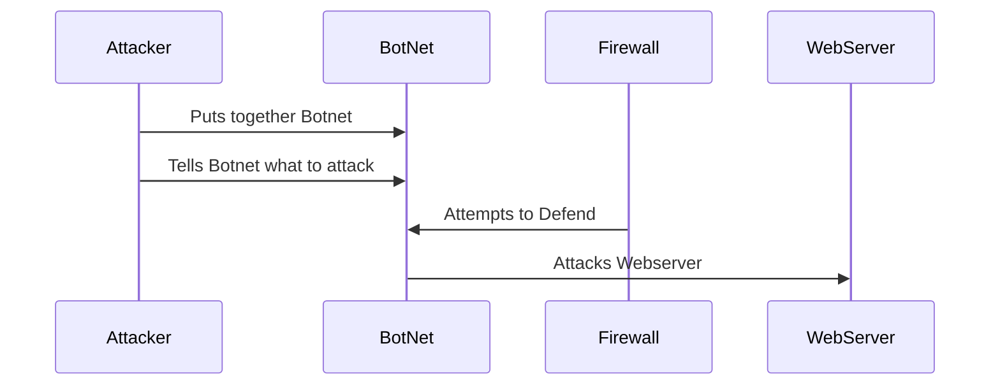

The Attacker puts together the BotNet by taking control of a large number of computers using Malware, then once it gets that large number of computers ready, it picks a WebServer to attack and tells all of the computers it took over to attack it. The Firewall can attempt to defend by detecting a bunch of traffic coming from one IP address but it can get overwhelemed and the DDoS can attack the WebServer drastically slowing down the WebServer.