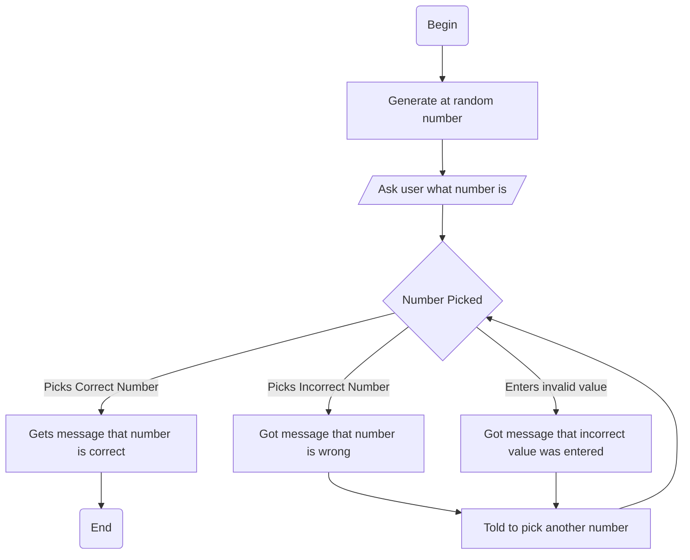

At first the computer generates a random number from 1 to 10 and the user is given a prompt that says something like "Guess a number between 1 and 10." The user is then told if they are right or not and if they are right the program ends. If they are wrong they are asked to enter another number and are told if that is correct or wrong. If they enter something invalid they are told so and asked to restart.