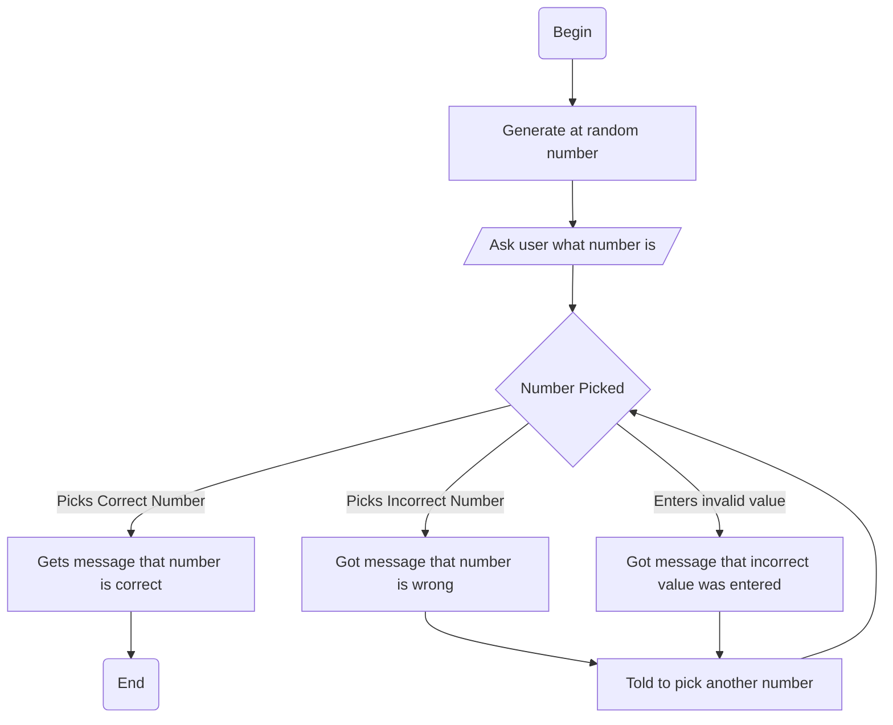

```mermaid
flowchart TD
Start(Begin)-->Generate[Generate at random number]
Generate --> Guess[/Ask user what number is /]
Guess --> Decision{Number Picked}
Decision --> |Picks Correct Number| Correct[Gets message that number is correct]
Decision --> |Picks Incorrect Number| Incorrect[Got message that number is wrong]
Incorrect --> Again[Told to pick another number]
Decision --> |Enters invalid value| Invalid[Got message that incorrect value was entered]
Invalid -->Again
Again --> Decision
Correct --> Finish(End)

```