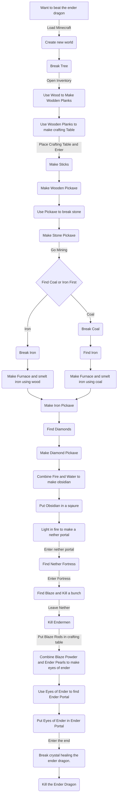

```mermaid
flowchart TD
    A[Want to beat the ender dragon] --> |Load Minecraft| B(Create new world)
    B --> C(Break Tree)
    C --> |Open Inventory| D(Use Wood to Make Wodden Planks)
    D --> E(Use Wooden Planks to make crafting Table)
    E --> |Place Crafting Table and Enter| F(Make Sticks)
    F --> G(Make Wooden Pickaxe)
    G --> H(Use Pickaxe to break stone)
    H --> I(Make Stone Pickaxe)
    I --> |Go Mining| J{Find Coal or Iron First}
    J --> |Coal| K1(Break Coal)
    J --> |Iron| K2(Break Iron)
    K1 --> L1(Find Iron)
    K2 --> L2(Make Furnace and smelt iron using wood)
    L1 --> M1(Make Furnace and smelt iron using coal)
    L2 --> N(Make Iron Pickaxe)
    M1 --> N
    N --> O(Find Diamonds)
    O -->  P(Make Diamond Pickaxe)
    P --> Q(Combine Fire and Water to make obsidian)
    Q --> R(Put Obsidian in a sqaure)
    R --> S(Light in fire to make a nether portal)
    S --> |Enter nether portal|T(Find Nether Fortress)
    T --> |Enter Fortress|U(Find Blaze and Kill a bunch)
    U --> |Leave Nether|V(Kill Endermen)
    V --> |Put Blaze Rods in crafting table| W(Combine Blaze Powder and Ender Pearls to make eyes of ender)
    W --> X(Use Eyes of Ender to find Ender Portal)
    X --> Y(Put Eyes of Ender in Ender Portal)
    Y --> |Enter the end|Z(Break crystal healing the ender dragon.)
    Z --> Win(Kill the Ender Dragon)


```