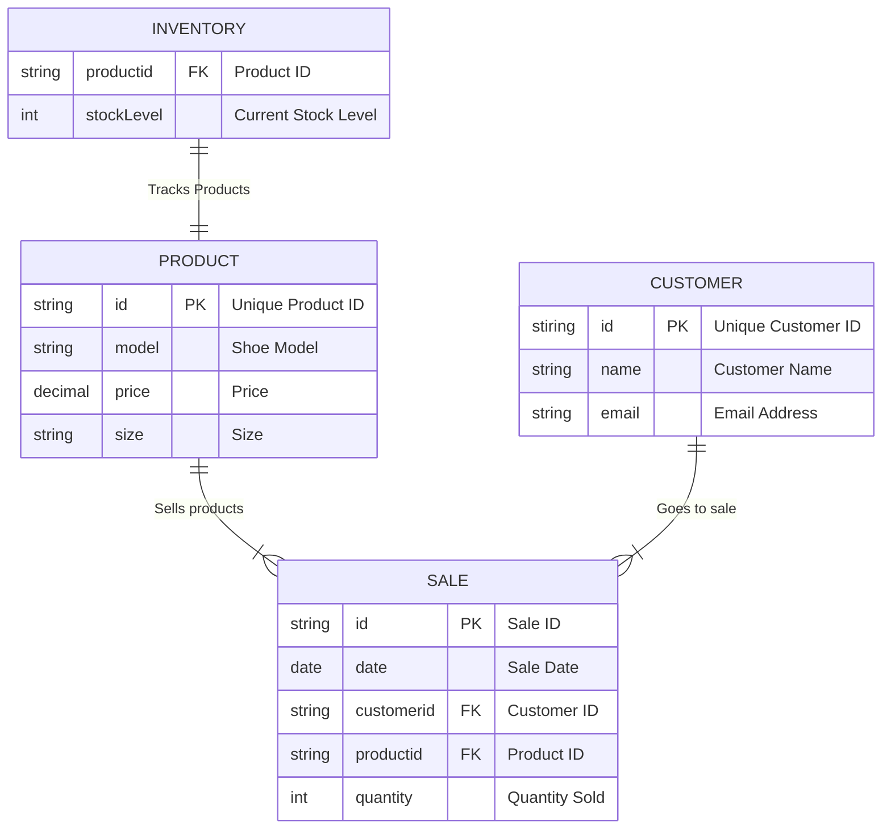

```mermaid
erDiagram
PRODUCT {
    string id PK "Unique Product ID"
    string model "Shoe Model"
    decimal price "Price"
    string size "Size"
}
CUSTOMER {
    stiring id PK "Unique Customer ID"
    string name "Customer Name"
    string email "Email Address"
}
SALE {
    string id PK "Sale ID"
    date date "Sale Date"
    string customerid FK "Customer ID"
    string productid FK "Product ID"
    int quantity "Quantity Sold"
}
INVENTORY {
    string productid FK "Product ID"
    int stockLevel "Current Stock Level"
}

PRODUCT ||--|{ SALE : "Sells products"
CUSTOMER ||--|{ SALE : "Goes to sale"
INVENTORY ||--|| PRODUCT : "Tracks Products"
```