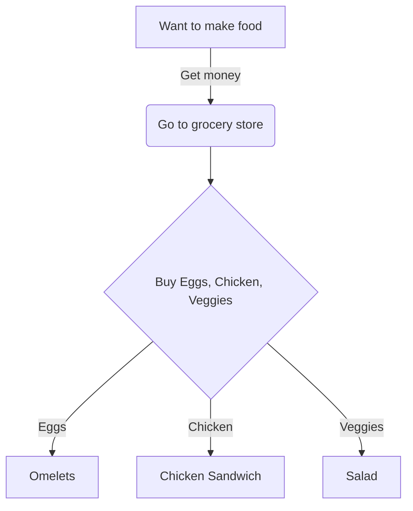
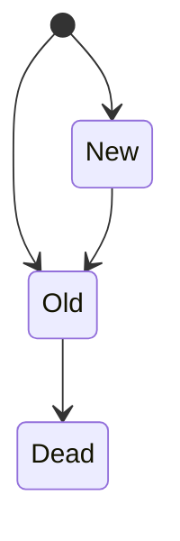

``` mermaid
flowchart TD
    A[Want to make food] -->|Get money| B(Go to grocery store)
    B --> C{Buy Eggs, Chicken, Veggies}
    C -->|Eggs| D[Omelets]
    C -->|Chicken| E[Chicken Sandwich]
    C -->|Veggies| F[Salad]
```

```mermaid
stateDiagram-v2
    [*] --> Old
    [*] --> New
    Old --> Dead
    New --> Old
```

